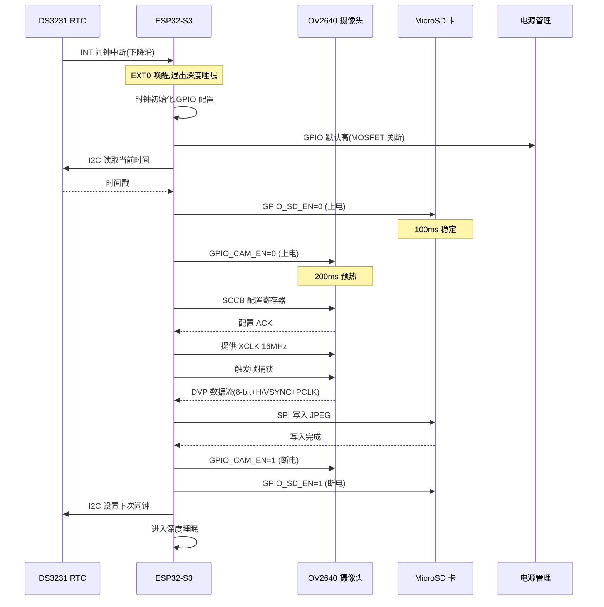
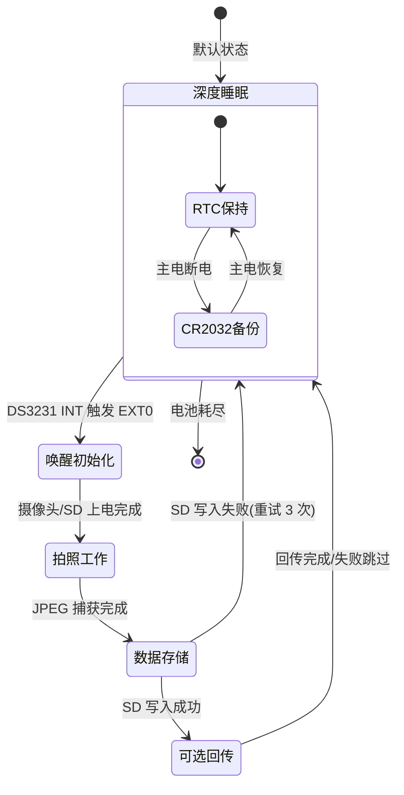
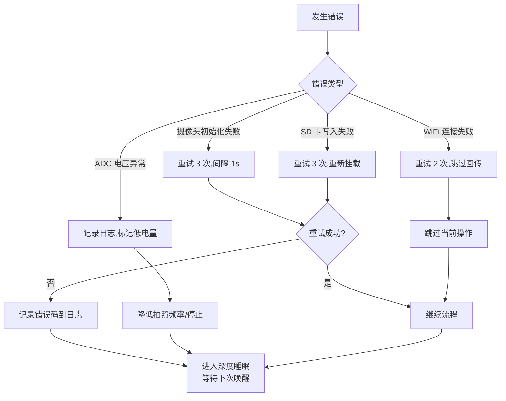

# 系统功能框图 - 户外定时拍照系统

> 文档版本：v1.0
> 本文档通过 ASCII 框图与 Mermaid 流程图描述系统的电源链路、信号链路、控制链路与工作流程。

## 1. 系统总体框图（ASCII）

```
                ┌─────────────────────────────────────────────────────────────────────┐
                │                          户外定时拍照系统                              │
                └─────────────────────────────────────────────────────────────────────┘

   ┌──────────────┐                                                                ┌──────────────┐
   │   太阳光照    │──光照──▶                                                          │   配置/调试    │
   └──────────────┘            ┌────────────┐    ┌────────────┐                   │  (UART/USB)   │
                               │ 5V 5W 单晶  │    │  CN3791    │                   └──────┬───────┘
                               │  太阳能板    │───▶│ MPPT 充电   │                          │
                               └────────────┘    │  控制器     │                          │
                                                  └─────┬──────┘                          │
                                                        │ 充电电流                          │
                                                        ▼                                  │
   ┌──────────────┐                            ┌──────────────┐      ┌──────────────┐    │
   │   CR2032     │◀──备份──── │  LiFePO4     │      │  HT7333      │    │
   │ (RTC 后备)   │             ┌───▶│  18650 电池  │─────▶│  LDO 3.3V    │    │
   └──────┬───────┘            │    │  3.2V 1500mAh│      │  Iq=4µA      │    │
          │                    │    └──────┬───────┘      └──────┬───────┘    │
          │                    │           │ ADC1 分压采样          │ 3.3V 系统电源 │
          │ I2C + INT          │           └───────────────────────┼────────────┼──┐
          │                    │                                    │            │  │
          ▼                    │                                    ▼            ▼  │
   ┌──────────────┐            │                          ┌─────────────────────────┐│
   │   DS3231SN   │            │                          │   ESP32-S3-WROOM-1      ││
   │   RTC        │◀──I2C──────┼──────────────────────────│   主控 MCU              ││
   │  (TCXO)      │──INT/EXT0──┼──────────────────────────│   - 双核 240MHz         ││
   └──────────────┘            │                          │   - 16MB Flash+8MB PSRAM││
                                │                          │   - Wi-Fi 4 / BLE 5     ││
                                │                          └──┬─────┬─────┬─────┬───┘│
                                │                             │     │     │     │    │
                                │             ┌───────────────┘     │     │     │    │
                                │             │ GPIO 控制 MOSFET     │     │     │    │
                                │             ▼ (上电/断电)          ▼     ▼     ▼    │
                                │  ┌──────────────┐         ┌────────┐ ┌──────┐ ┌────┐│
                                │  │ AO3401 P-MOS │         │ DVP    │ │ SPI  │ │ADC ││
                                │  │ Q1: 摄像头电源│         │ 8-bit  │ │ SD卡 │ │电池││
                                │  └──────┬───────┘         │ 摄像头 │ │      │ │电压││
                                │         │                 │ 接口   │ │      │ │采样││
                                │         ▼                 └───┬────┘ └──┬───┘ └────┘│
                                │  ┌──────────────┐             │ 18 线    │ 4 线       │
                                │  │  OV2640      │◀────────────┘          │           │
                                │  │  摄像头模组   │                        │           │
                                │  │  (2MP JPEG)  │                        ▼           │
                                │  └──────────────┘                 ┌──────────────┐  │
                                │                                   │ MicroSD 卡   │  │
                                │  ┌──────────────┐                 │ (照片/日志)   │  │
                                │  │ AO3401 P-MOS │                 └──────────────┘  │
                                │  │ Q2: SD 卡电源 │                                   │
                                │  └──────┬───────┘                                   │
                                │         │                                           │
                                └─────────┴─────────────(可选)WiFi 回传──────────────┘
                                                                          ▲
                                                                  ┌───────┴───────┐
                                                                  │ 远程服务器/网关│
                                                                  └───────────────┘
```

## 2. 电源链路框图

```
 ┌────────────┐    直流 5V     ┌────────────┐   充电电流   ┌────────────┐  3.2~3.65V  ┌─────────┐  3.3V  ┌────────┐
 │ 5V 5W      │──────────────▶│ CN3791     │────────────▶│ LiFePO4    │───────────▶│ HT7333  │───────▶│ 系统   │
 │ 太阳能板    │               │ MPPT 充电   │  恒流-恒压    │ 18650 电池  │            │ LDO     │        │ 3.3V   │
 └────────────┘               │ 控制器      │  3.65V 截止   │ 3.2V 1500mAh│           └─────────┘        │ 负载   │
        │                     └────────────┘              └─────┬──────┘                               └────────┘
        │                          ▲                            │ 分压 R1/R2 = 100k/100k
        │                          │ MPPT 跟踪                   │ → ADC1_CH0 (1.825V @ 满电)
        │                          │                            ▼
        └──弱光时 MPPT 自动调整输入阻抗寻找最大功率点              [电压采样→ESP32 ADC]
```

### 电源链路关键节点

| 节点 | 电压范围 | 来源 | 去向 |
|------|----------|------|------|
| 太阳能板输出 | 0~6V（Vmp 5V） | 光伏 | CN3791 输入 |
| CN3791 电池端 | 2.5~3.65V | 充电 IC | 电池 + LDO 输入 |
| 电池电压 | 2.5~3.65V（3.2V 标称） | 电池 | LDO + ADC 分压 |
| LDO 输出 | 3.3V ±2% | HT7333 | ESP32-S3 3V3 + MOSFET 源极 |
| 摄像头电源 | 0 或 3.3V | Q1 MOSFET | OV2640 VDD |
| SD 卡电源 | 0 或 3.3V | Q2 MOSFET | MicroSD VDD |

## 3. 信号链路框图

```
 ┌─────────────────────────────────────────────────────────────────────────┐
 │                          信号链路（数据/控制信号）                          │
 └─────────────────────────────────────────────────────────────────────────┘

   [图像采集信号链]
   ┌──────────┐  DVP 8-bit 并行数据 (D0~D7) ┌──────────────────┐
   │  OV2640  │  + HSYNC / VSYNC / PCLK      │                  │
   │  摄像头   │◀──XCLK (16MHz, ESP32 提供)──│  ESP32-S3        │
   │          │  + SDA/SCL (SCCB 配置)        │  LCD_CAM 外设     │
   └──────────┘  + RESET / PWDN              └──────────────────┘

   [RTC 通信与唤醒链]
   ┌──────────┐  I2C: SDA/SCL @ 100kHz       ┌──────────────────┐
   │  DS3231  │──────────────────────────────▶│                  │
   │   RTC    │  INT (开漏+上拉) 闹钟中断     │  ESP32-S3        │
   │          │──────────────────────────────▶│  EXT0 唤醒源      │
   └──────────┘                               └──────────────────┘

   [SD 卡存储链]
   ┌──────────┐  SPI: MOSI/MISO/SCK/CS       ┌──────────────────┐
   │ MicroSD  │  @ 20MHz (默认)               │                  │
   │   卡     │◀─────────────────────────────▶│  ESP32-S3        │
   └──────────┘  (SPI 模式)                   │  SPI2 外设        │
                                               └──────────────────┘

   [电池电压采样链]
   ┌──────────┐  R1/R2=100k/100k 分压         ┌──────────────────┐
   │  电池    │  Vbat/2 → ADC1_CH0            │                  │
   │ 3.2~3.65V│──────────────────────────────▶│  ESP32-S3        │
   └──────────┘                               │  ADC1 12-bit      │
                                               └──────────────────┘

   [调试 UART 链]
   ┌──────────┐  TX/RX @ 115200bps            ┌──────────────────┐
   │ USB-TTL  │◀─────────────────────────────▶│  ESP32-S3        │
   │  /串口    │                               │  UART0           │
   └──────────┘                               └──────────────────┘
```

## 4. 控制链路框图

```
 ┌─────────────────────────────────────────────────────────────────────────┐
 │                          控制链路（GPIO 受控）                             │
 └─────────────────────────────────────────────────────────────────────────┘

   [受控上电：MOSFET 高边开关]
   ┌──────────────────┐   GPIO 输出 (低电平=上电, 高电平=断电)
   │   ESP32-S3       │──GPIO_CAM_EN──────────────────┐
   │                  │──GPIO_SD_EN ─────────────────┐│
   └──────────────────┘                              ││
                                                     ││
                          10kΩ 上拉到 3.3V           ││
                          (确保复位时 MOSFET 关断)     ││
                                │                    ││
                                ▼                    ▼│
                          ┌─────────┐         ┌─────────┐
   3.3V 主电源 ──────────▶│ AO3401  │ 3.3V──▶│ AO3401  │
                          │  Q1     │         │  Q2     │
                          │ (P-MOS) │         │ (P-MOS) │
                          └────┬────┘         └────┬────┘
                               │ 3.3V (受控)      │ 3.3V (受控)
                               ▼                  ▼
                          ┌─────────┐         ┌─────────┐
                          │ OV2640  │         │ MicroSD │
                          │ 摄像头   │         │  卡座   │
                          └─────────┘         └─────────┘

   [唤醒控制：DS3231 INT → EXT0]
   ┌──────────────────┐   闹钟到点
   │   DS3231 RTC     │──INT (开漏, 4.7kΩ 上拉)──▶  GPIO_RTC_INT (EXT0)
   └──────────────────┘                                  │
                                                          ▼
                                                ┌──────────────────┐
                                                │  ESP32-S3        │
                                                │  深度睡眠 → 唤醒   │
                                                └──────────────────┘

   [配置按钮输入]
   ┌─────────┐   按下 (低电平)    ┌──────────────────┐
   │ 配置按键 │──────────────────▶│  GPIO_CFG_BTN    │
   │ (硅胶帽) │   长按 5s         │  (EXT1 唤醒源)    │
   └─────────┘                   └──────────────────┘
                                        │
                                        ▼
                                  进入 AP 配置模式
```

### 控制链路逻辑表

| 控制对象 | 控制源 | 触发方式 | 默认状态 | 备注 |
|----------|--------|----------|----------|------|
| OV2640 电源 | GPIO_CAM_EN | 低=上电 / 高=断电 | 断电（上拉） | 拍照前 200ms 上电预热 |
| MicroSD 电源 | GPIO_SD_EN | 低=上电 / 高=断电 | 断电（上拉） | 拍照前 100ms 上电 |
| ESP32 唤醒 | DS3231 INT | 下降沿 | 高电平（上拉） | EXT0 唤醒源 |
| 配置按钮 | GPIO_CFG_BTN | 低电平 | 高电平（上拉） | 长按 5s 进 AP 模式，EXT1 唤醒 |
| 系统复位 | EN 引脚 | 低电平 | 高电平（上拉） | 复位按键 SW2 触发 |

## 5. 工作流程图（Mermaid）

### 5.1 主工作流程

```mermaid
flowchart TD
    A[上电/RTC INT 唤醒] --> B[ESP32-S3 退出深度睡眠]
    B --> C[初始化外设<br/>GPIO/ADC/UART]
    C --> D[读 RTC 时间<br/>I2C 读取 DS3231]
    D --> E[读 SD 卡 config.json<br/>拍照间隔/分辨率/质量/回传开关]
    E --> F{配置有效?}
    F -- 否 --> F1[使用默认配置<br/>记录日志]
    F1 --> G
    F -- 是 --> G[GPIO_SD_EN = 0<br/>上电 SD 卡]
    G --> H[GPIO_CAM_EN = 0<br/>上电摄像头<br/>延时 200ms 预热]
    H --> I[初始化摄像头<br/>SCCB 配置分辨率/JPEG质量]
    I --> J{摄像头就绪?}
    J -- 否 --> J1[重试 3 次]
    J1 --> J2{重试成功?}
    J2 -- 否 --> K1[记录错误日志<br/>跳到深度睡眠]
    J2 -- 是 --> K[触发拍照<br/>捕获 JPEG 帧]
    J -- 是 --> K
    K --> L[写入 SD 卡<br/>/photos/YYYYMMDD/HHMMSS.jpg]
    L --> M{写入成功?}
    M -- 否 --> M1[重试 3 次]
    M1 --> M2{重试成功?}
    M2 -- 否 --> K1
    M2 -- 是 --> N
    M -- 是 --> N[GPIO_CAM_EN = 1<br/>断电摄像头]
    N --> O[检查剩余空间<br/>不足 10% 清理最早目录]
    O --> P{回传启用?}
    P -- 是 --> Q[开启 Wi-Fi<br/>连接 AP]
    Q --> R[HTTP POST/MQTT<br/>上传照片或缩略图]
    R --> S{上传成功?}
    S -- 否 --> S1[重试 2 次]
    S1 --> S2{仍失败?}
    S2 -- 是 --> T[跳过回传<br/>记录日志]
    S2 -- 否 --> T
    S -- 是 --> T[关闭 Wi-Fi]
    P -- 否 --> T
    T --> U[设置 DS3231 下次闹钟]
    U --> V[GPIO_SD_EN = 1<br/>断电 SD 卡]
    V --> W[ADC 采样电池电压]
    W --> X{电压 < 3.0V?}
    X -- 是 --> X1[降低拍照频率<br/>记录低电量日志]
    X1 --> Y
    X -- 否 --> Y[进入深度睡眠<br/>等待下次 INT 唤醒]
    Y --> Z[END: 深度睡眠<br/>系统电流 ~0.5mA]

    K1 --> U
```



### 5.2 上电初始化时序



### 5.3 电源状态机



### 5.4 错误处理流程



## 6. 模块功能说明

### 6.1 主控模块（ESP32-S3-WROOM-1）
- **职责**：系统总控，调度拍照、存储、回传、电源管理、配置解析
- **关键外设**：DVP（LCD_CAM）、SPI2、I2C、UART0、ADC1、GPIO
- **工作模式**：99% 时间在深度睡眠，被唤醒后高效完成任务即休眠

### 6.2 摄像头模块（OV2640）
- **职责**：图像采集，内置 JPEG 编码
- **接口**：DVP 8-bit 并行 + SCCB 配置（I2C 兼容）
- **电源**：受控于 Q1 MOSFET，待机时断电（避免 OV2640 待机 ~10mA 漏电）

### 6.3 RTC 模块（DS3231）
- **职责**：高精度计时 + 定时闹钟唤醒
- **接口**：I2C（地址 0x68）+ INT 中断输出
- **后备**：CR2032 纽扣电池，主电断电保持时间 ≥ 1 年

### 6.4 电源管理模块
- **职责**：太阳能充电、电池储能、稳压输出、受控上电、电压采样
- **关键元件**：CN3791（MPPT 充电）、LiFePO4 18650、HT7333（LDO）、AO3401（MOSFET×2）
- **核心策略**：深睡时仅 RTC + ESP32 RTC RAM 供电，所有外设断电

### 6.5 存储模块（MicroSD）
- **职责**：照片（JPEG）+ 日志（log）+ 配置（config.json）持久化
- **接口**：SPI 模式（MOSI/MISO/SCK/CS）
- **电源**：受控于 Q2 MOSFET，待机时断电

### 6.6 通信模块（可选，Wi-Fi）
- **职责**：远程回传照片/缩略图、OTA 升级
- **接口**：ESP32-S3 内置 Wi-Fi 4
- **策略**：仅在需要回传时开启，回传完成立即关闭以省电

## 7. 数据流向总结

```
[光照] → [太阳能板] → [CN3791] → [电池] → [LDO] → [ESP32]
                                                    │
                ┌───────────────────────────────────┘
                │
        [DS3231 INT 唤醒] → [ESP32 退出深睡] → [上电外设] → [OV2640 拍照]
                                                                    │
                                                                    ▼
                                                              [JPEG 数据]
                                                                    │
                                              ┌─────────────────────┤
                                              ▼                     ▼
                                       [SPI 写入 SD 卡]      [可选 Wi-Fi 回传]
                                              │                     │
                                              ▼                     ▼
                                       [本地存储]              [远程服务器]
                                              │
                                              ▼
                                    [断电外设] → [设下次闹钟] → [深睡]
```

## 8. 关键设计指标

| 指标 | 目标值 | 实现方式 |
|------|--------|----------|
| 深度睡眠电流 | < 1mA（含 RTC） | ESP32-S3 深睡 ~230µA + DS3231 ~200µA + LDO Iq 4µA + 分压漏电 ~16µA |
| 拍照工作电流 | < 300mA | ESP32 ~120mA + OV2640 ~100mA + SD 写入 ~80mA |
| 平均日功耗 | < 0.6Wh | 详见 power_design.md |
| 连续阴雨运行 | ≥ 7 天 | 1500mAh × 3.2V = 4.8Wh / 0.6Wh/天 = 8 天余量 |
| 拍照间隔可调 | 1 分钟 ~ 24 小时 | DS3231 双闹钟 + 软件配置 |
| 照片分辨率 | UXGA 1600×1200 | OV2640 + PSRAM 缓冲 |
| 存储格式 | JPEG, 200KB/张 | OV2640 内置 JPEG 编码器 |
| 防护等级 | IP65 | 密封圈 + 防水接头 + 硅胶按键 |
| 工作温度 | -20~+60℃ | 宽温元件选型 |
